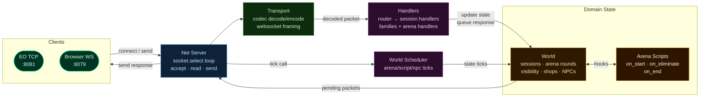

# Scorpion

A dedicated **Endless Online arena server** written in Lua 5.1. Players queue, get warped into combat zones, fight, and respawn until one remains.

---

## Quick Start

Run from an **elevated PowerShell** window the first time (needed for Chocolatey installs):

```powershell
powershell -ExecutionPolicy Bypass -File install.ps1
```

`install.ps1` will:
- install missing dependencies (`lua`, `mongodb`, `mongosh`) via Chocolatey
- create/use local Mongo data at `Data\mongo`
- start `mongod` on `127.0.0.1:27017` if it is not running
- start Scorpion

After dependencies are installed, non-elevated runs are fine.

---

## Manual Run

If you prefer separate terminals:

1. Start MongoDB:

```powershell
mongod --dbpath .\Data\mongo --bind_ip 127.0.0.1 --port 27017
```

2. Start server:

```powershell
& "C:\Program Files (x86)\Lua\5.1\lua.exe" lua/main.lua
```

---

## Connecting

EO client version `0.0.28` - point it at `127.0.0.1:8081`.
Browser/WebSocket clients use port `8079`.

---

## MongoDB Runtime

MongoDB is required at runtime. There is no file or pure-memory account fallback.

- Default URI: `mongodb://127.0.0.1:27017`
- Default DB: `scorpion`
- If `mongosh` is not on PATH in your runtime shell, set `persistence.mongodb.mongosh_path` to an absolute path (for example `C:/Users/<you>/AppData/Local/Programs/mongosh/mongosh.exe`).

---

## Data Files

Copy your EO client's pub files and map files into:

| Path | Contents |
|---|---|
| `Data/Maps/` | `.emf` map files, named by ID (for example `46.emf`) |
| `Data/Pub/` | `dat001.ecf`, `dat001.eif`, `dtn001.enf`, `dsl001.esf` |

---

## Configuration

All settings are in [lua/scorpion/infrastructure/settings.lua](lua/scorpion/infrastructure/settings.lua).

| Setting | Default | Description |
|---|---|---|
| `host` | `127.0.0.1` | Bind address - set to `0.0.0.0` for public |
| `port` | `8081` | TCP port |
| `net.websocket_port` | `8079` | WebSocket port |
| `arena.map` | `46` | Arena map ID |
| `arena.spawn_source` | `"settings"` | Arena queue spawn source: `settings`, `emf`, or `auto` |
| `arena.block` | `4` | Max players per round |
| `scripts.arena.loser_duration_seconds` | `60` | Loser disguise duration |
| `scripts.arena.winner_gold_reward` | `500` | Gold awarded to round winner |
| `scripts.arena.loser_gold_penalty` | `100` | Gold deducted from final loser |
| `logging.packet_flow` | `false` | Log every packet (verbose) |
| `persistence.mongodb.uri` | `mongodb://127.0.0.1:27017` | MongoDB connection string |
| `persistence.mongodb.database` | `scorpion` | MongoDB database name |
| `persistence.mongodb.mongosh_path` | `mongosh` | `mongosh` binary path (set absolute path on Windows if needed) |

Account data is persisted in MongoDB. `settings.accounts` are treated as seed accounts and will be created on boot if missing.

Arena spawn notes:
- Default is `settings` (safe for maps that have unrelated local warps).
- `arena.spawn_source = "auto"`: uses EMF local warp rows on the arena map when present, otherwise uses `arena.spawns`.
- `arena.spawn_source = "emf"`: map-driven only.
- `arena.spawn_source = "settings"`: static `arena.spawns` only.

---

## Architecture



Logs -> `logs/scorpion.log`

---

## Contributor Layout

Use this as the primary navigation map when changing gameplay behavior:

- `lua/scorpion/bootstrap.lua`: wires all dependencies.
- `lua/scorpion/application/handlers/session_handlers.lua`: packet-family entrypoints and shared helper surface for family handlers.
- `lua/scorpion/application/handlers/families/*.lua`: per-family behavior (`account`, `login`, `gamedata`, `warp`, `shop`, `item`, `paperdoll`, etc.).
- `lua/scorpion/application/handlers/families/gamedata/*.lua`: action-specific GameData handlers (`request`, `agree`, `message`).
- `lua/scorpion/application/handlers/arena_handlers.lua`: arena-specific walk/attack/warp orchestration.
- `lua/scorpion/application/handlers/support/session_support.lua`: shared session helper logic.
- `lua/scorpion/application/handlers/support/arena_support.lua`: arena movement/collision and packet helper logic.
- `lua/scorpion/application/handlers/support/nearby.lua`: nearby/player-map serialization and nearby queries (players + static/runtime NPCs).
- `lua/scorpion/application/handlers/support/inventory_state.lua`: inventory, gold, equipment, and weight helpers.
- `lua/scorpion/application/services/world_scheduler.lua`: world tick orchestration (arena/script/NPC), called by server runtime.
- `lua/scorpion/domain/world.lua`: domain composition root.
- `lua/scorpion/domain/world/*.lua`: focused world concerns (`sessions`, `visibility`, `warp`, `arena_round`, `shops`, `runtime_npcs`).
- `lua/scorpion/transport/world_packets.lua`: transport packet adapter injected into world (keeps packet/protocol details out of domain modules).
- `lua/scorpion/infrastructure/accounts_mongo.lua` + `mongosh_client.lua`: Mongo-backed account/character persistence.
- `lua/scorpion/infrastructure/shop_db.lua` + `shop_text_db.lua`: shop DB loading and parser support.
- `lua/scorpion/infrastructure/eif_parser.lua` + `enf_parser.lua`: item/NPC pub parsers used by inventory/shop flows.

Rule of thumb:
- Add packet behavior in `families/`.
- Add reusable helper logic in `support/`.
- Keep `session_handlers.lua` and `arena_handlers.lua` as orchestration layers, not dump files.

---

## Arena Script Hooks

You can customize arena round behavior with a Lua script:

- Script file: `lua/scorpion/scripts/arena.lua`
- Settings: `lua/scorpion/infrastructure/settings.lua` under `scripts.arena`
- Hooks:
  - `on_arena_start(api, ctx)`
  - `on_arena_eliminate(api, ctx)`
  - `on_arena_end(api, ctx)`

`ctx` includes:
- `victim`, `killer` (session tables)
- `victim_id`, `killer_id`, `direction`
- `arena_players` (session list of current round participants)
- `victim_origin` (`map_id`, `x`, `y`, `direction`)
- `winner`, `winner_id`, `last_victim`, `last_victim_id` (for `on_arena_end`)

`api` includes:
- `api.temporarily_disguise_as_npc(session, { npc_id?, seconds? })`
- `api.temporarily_override_appearance(session, { seconds?, hair_style?, ... })`
- `api.get_gold(session)`, `api.add_gold(session, delta)`, `api.set_gold(session, amount)`
- `api.warp_player(session, map_id, x, y, direction?)`
- `api.arena_respawn(session)`
- `api.random_choice(list)`
- `api.random_npc_id([list])`
- `api.clear_disguise(session)`
- `api.config()`
- `api.log(level, message, fields)`

Notes:
- Character packets only expose player appearance fields (sex/hair/skin), not NPC sprite IDs.
- `npc_id` is used as a deterministic seed for temporary disguise style.
- Safe appearance limits are configurable in `scripts.arena.appearance_limits`.
- Arena elimination script currently applies loser disguise (mass-bald path is disabled).
- Arena end script can apply configurable payouts (`scripts.arena.winner_gold_reward`, `scripts.arena.loser_gold_penalty`).
- Loser disguise uses an NPC proxy workaround: hide player map entity, then spawn/move a runtime NPC proxy with `Npc.Agree` / `Npc.Player` (despawn via `Npc.Spec`).
- Scripted gold changes push inventory packets to keep client UI in sync:
  - gain -> `Item.Get`
  - loss -> `Item.Kick`
- Appearance packet rules (nearby-player sync):
  - hairstyle/bald changes -> `Avatar.Agree` with `AvatarChangeType=Hair (2)`
  - hair-color-only changes -> `Avatar.Agree` with `AvatarChangeType=HairColor (3)`
  - name/level/sex/skin changes -> `Avatar.Remove` then `Players.Agree` (`NearbyInfo`)

Example (`on_arena_end` payout):

```lua
function M.on_arena_end(api, ctx)
  local cfg = api.config() or {}
  local winner_reward = cfg.winner_gold_reward or 500
  local loser_penalty = cfg.loser_gold_penalty or 100

  if ctx.winner then
    api.add_gold(ctx.winner, winner_reward)
  end

  if ctx.last_victim then
    api.add_gold(ctx.last_victim, -loser_penalty)
  end
end
```
