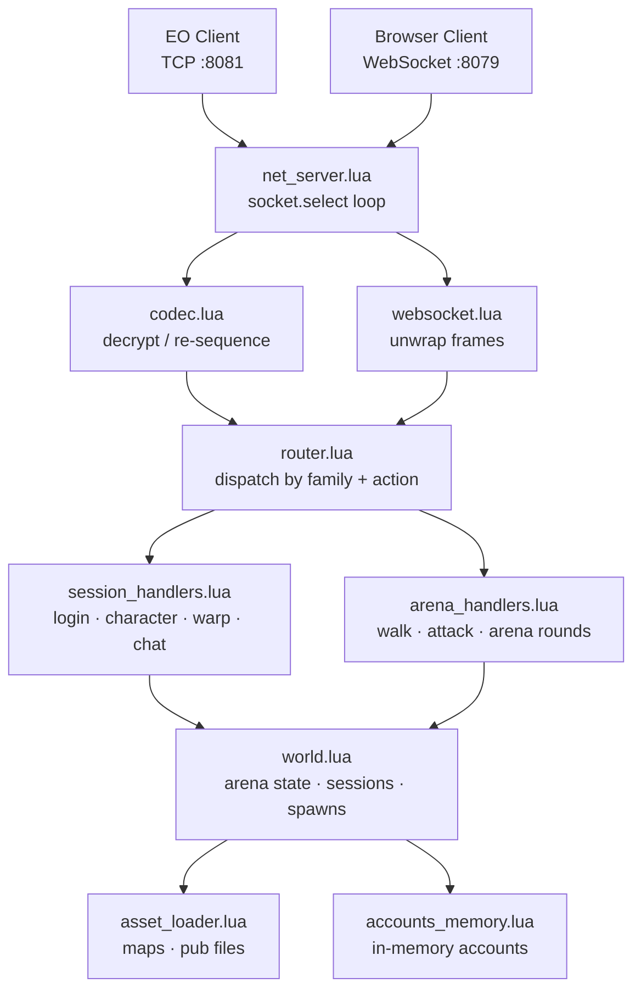

# Scorpion

A dedicated **Endless Online arena server** written in Lua 5.1. Players queue, get warped into combat zones, fight, and respawn until one remains.

---

## Quick Start

```powershell
powershell -ExecutionPolicy Bypass -File install.ps1
```

Installs Lua 5.1 via Chocolatey if needed, then starts the server. To start manually after install:

```powershell
& "C:\Program Files (x86)\Lua\5.1\lua.exe" lua/main.lua
```

---

## Connecting

EO client version `0.0.28` — point it at `127.0.0.1:8081`. Browser/WebSocket clients use port `8079`.

---

## Data Files

Copy your EO client's pub files and map files into:

| Path | Contents |
|---|---|
| `Data/Maps/` | `.emf` map files, named by ID (e.g. `46.emf`) |
| `Data/Pub/` | `dat001.ecf`, `dat001.eif`, `dtn001.enf`, `dsl001.esf` |

---

## Configuration

All settings are in [lua/scorpion/infrastructure/settings.lua](lua/scorpion/infrastructure/settings.lua).

| Setting | Default | Description |
|---|---|---|
| `host` | `127.0.0.1` | Bind address — set to `0.0.0.0` for public |
| `port` | `8081` | TCP port |
| `net.websocket_port` | `8079` | WebSocket port |
| `arena.map` | `46` | Arena map ID |
| `arena.block` | `4` | Max players per round |
| `logging.packet_flow` | `false` | Log every packet (verbose) |

Accounts are hardcoded in settings — no database:

```lua
accounts = {
  admin  = { password = "admin",  role = "admin" },
  player = { password = "player", role = "player" },
}
```

---

## Architecture



Logs → `logs/scorpion.log`

---

## Contributor Layout

Use this as the primary navigation map when changing gameplay behavior:

- `lua/scorpion/bootstrap.lua`: wires all dependencies.
- `lua/scorpion/application/handlers/session_handlers.lua`: packet-family entrypoints and shared helper surface for family handlers.
- `lua/scorpion/application/handlers/families/*.lua`: per-packet-family behavior (`account`, `login`, `gamedata`, `warp`, etc.).
- `lua/scorpion/application/handlers/families/gamedata/*.lua`: action-specific GameData handlers (`request`, `agree`, `message`).
- `lua/scorpion/application/handlers/arena_handlers.lua`: arena-specific walk/attack/warp orchestration.
- `lua/scorpion/application/handlers/support/session_support.lua`: shared session helper logic reused by multiple families.
- `lua/scorpion/application/handlers/support/arena_support.lua`: arena movement/collision and packet helper logic.
- `lua/scorpion/application/handlers/support/nearby.lua`: nearby/player-map serialization and nearby queries.
- `lua/scorpion/domain/world.lua`: domain composition root (delegates to focused world modules).
- `lua/scorpion/domain/world/*.lua`: focused world concerns (`sessions`, `visibility`, `warp`, `arena_round`).

Rule of thumb:
- Add packet behavior in `families/`.
- Add reusable helper logic in `support/`.
- Keep `session_handlers.lua` and `arena_handlers.lua` as orchestration layers, not dump files.

---

## Arena Script Hooks

You can customize arena elimination behavior with a Lua script:

- Script file: `lua/scorpion/scripts/arena.lua`
- Settings: `lua/scorpion/infrastructure/settings.lua` under `scripts.arena`
- Hook exposed today: `on_arena_eliminate(api, ctx)`

`ctx` includes:
- `victim`, `killer` (session tables)
- `victim_id`, `killer_id`, `direction`
- `arena_players` (session list of current round participants)
- `victim_origin` (`map_id`, `x`, `y`, `direction`)

`api` includes:
- `api.temporarily_disguise_as_npc(session, { npc_id?, seconds? })`
- `api.temporarily_override_appearance(session, { seconds?, hair_style?, ... })`
- `api.get_gold(session)`, `api.add_gold(session, delta)`, `api.set_gold(session, amount)`
- `api.random_npc_id([list])`
- `api.clear_disguise(session)`
- `api.config()`
- `api.log(level, message, fields)`

Notes:
- Character packets only expose player appearance fields (sex/hair/skin), not NPC sprite ids.
- `npc_id` is used as a deterministic seed for a temporary disguise style.
- Safe appearance limits are configurable in `scripts.arena.appearance_limits`.
- Arena elimination script currently applies loser disguise (mass-bald path is disabled for now).
- Arena end script can apply configurable payouts (`scripts.arena.winner_gold_reward`, `scripts.arena.loser_gold_penalty`).
- Loser disguise now uses an NPC proxy workaround: hide player map entity, then spawn/move a runtime NPC proxy with `Npc.Agree` / `Npc.Player` (despawn via `Npc.Spec`).
- Appearance packet rules (important for nearby-player sync):
- Bald / hairstyle changes: send `Avatar.Agree` with `AvatarChangeType=Hair (2)` and payload `player_id, change_type, sound, hair_style, hair_color`.
- Hair-color-only changes: send `Avatar.Agree` with `AvatarChangeType=HairColor (3)` and payload `player_id, change_type, sound, hair_color`.
- Name/level/sex/skin are not hair deltas; force a visible re-spawn (`Avatar.Remove` then `Players.Agree` with `NearbyInfo`).
- Push a self-directed `Players.Agree` refresh if you need the local player client to immediately reflect scripted appearance changes.

Example:

```lua
function M.on_arena_eliminate(api, ctx)
  local victim = ctx.victim
  if not victim then return end
  api.temporarily_disguise_as_npc(victim, {
    npc_id = api.random_npc_id(),
    seconds = 3,
  })
end
```
